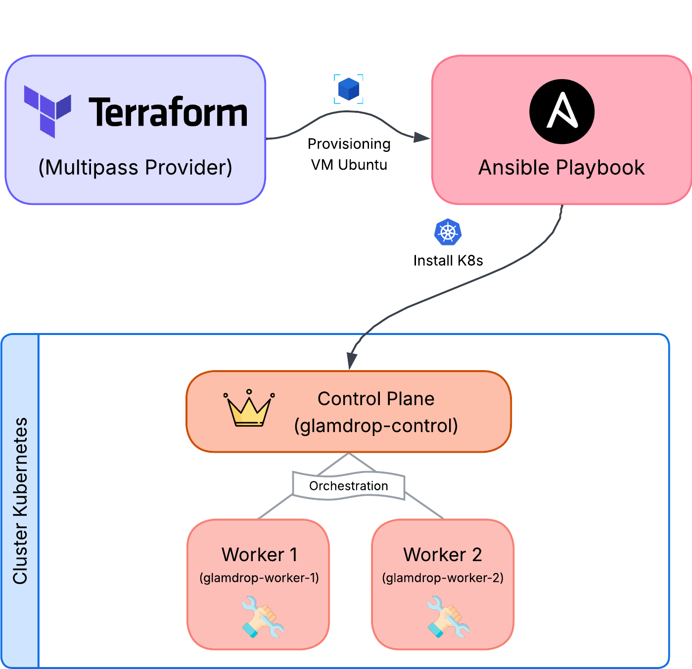
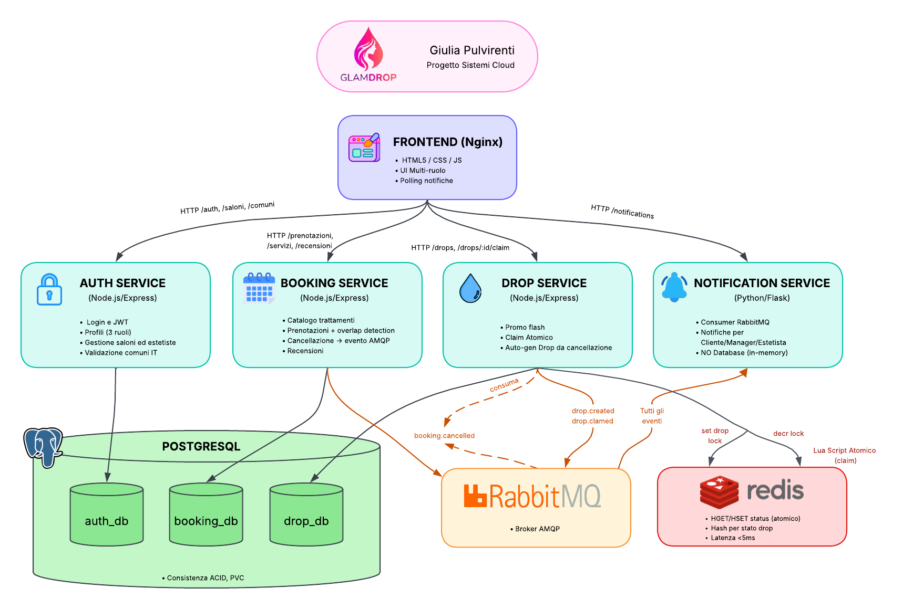

<div align="center">


<h1 align="center">GlamDrop EKS — Beauty Booking Platform su Amazon EKS</h1>

<p align="center">
  Versione enterprise cloud-native della piattaforma <strong>GlamDrop</strong> su <strong>Amazon Elastic Kubernetes Service (EKS)</strong>.<br>
  Control Plane gestito ad alta affidabilità Multi-AZ, <strong>EKS Managed Node Groups</strong>,<br>
  networking nativo ad alte prestazioni con <strong>AWS VPC CNI</strong> e segregazione dei privilegi con <strong>IAM Roles for Service Accounts (IRSA)</strong>.<br>
  Mitigazione atomica del <strong>Thundering Herd Problem</strong> tramite script Lua in-memory su ElastiCache Redis.
</p>

[](LICENSE)


</div>


## 📑 Indice

- [Panoramica](#-panoramica)
- [Funzionalità Principali](#-funzionalità-principali)
- [Architettura & Flusso degli Eventi](#-architettura--flusso-degli-eventi)
- [Stack Tecnologico & Mappatura Servizi AWS](#-stack-tecnologico--mappatura-servizi-aws-gestiti)
- [Infrastruttura EKS](#️-infrastruttura-eks)
- [Deployment](#-deployment-su-amazon-eks)
- [Configurazione](#-configurazione-variabili-dambiente-e-secret-kubernetes)
- [Test Automatizzati](#-test-automatizzati)
- [Teardown](#-teardown-dellinfrastruttura)
- [Struttura del Progetto](#-struttura-del-progetto)


## 🎯 Panoramica

**GlamDrop** è un'applicazione web 3-tier a microservizi per la prenotazione di servizi beauty e la gestione di promozioni flash (*Drop*) a disponibilità limitata. Il sistema copre l'intero ciclo di vita del software: dall'**Infrastructure as Code** (IaC) al **frontend**, integrando orchestrazione dei container, messaggistica asincrona event-driven e gestione della concorrenza ad alte prestazioni.

> Questa versione (**Infrastruttura B**) rappresenta la variante enterprise reingegnerizzata su **Amazon Elastic Kubernetes Service (EKS v1.36)** con Control Plane gestito, nodi scalabili e sicurezza IAM nativa (IRSA).

La piattaforma mette in relazione tre tipologie di utenti:

<div align="center">

| 👤 Ruolo | Descrizione |
|:---:|---|
|  | Ricerca saloni con autocompletamento geografico (dataset ISTAT), prenota trattamenti estetici e riscatta i Drop promozionali |
|  | Amministra il salone, gestisce il catalogo trattamenti, configura turni/orari del personale e monitora le prenotazioni |
|  | Consulta l'agenda appuntamenti in tempo reale, visualizza i dettagli dei trattamenti e segnala indisponibilità |

</div>

### ⚡ Il Concetto di "Drop" e la Gestione della Concorrenza

Il cuore della piattaforma sono i **Drop**: promozioni flash a disponibilità limitata con **sconto del 50%**, generate automaticamente a seguito di cancellazioni tardive (< 24 ore dall'appuntamento) o create manualmente dai gestori.

Per mitigare il **Thundering Herd Problem** ed evitare fenomeni di *overselling* durante i picchi simultanei di richiesta:
1. **Lock Atomico in-memory**: La concorrenza sul riscatto è gestita a livello di cache in-memory (**Redis**) tramite operazioni atomiche (`SET NX` / script Lua single-thread).
2. **Latenza Sub-millisecondo**: Il sistema risponde immediatamente con HTTP `202 Accepted` all'unico vincitore del claim e con HTTP `409 Conflict` a tutti gli altri tentativi concorrenti in $< 2\text{ms}$.
3. **Persistenza Asincrona Event-Driven**: Il claim confermato viene pubblicato su una coda dedicata (**RabbitMQ**) per la finalizzazione asincrona su database relazionale (**PostgreSQL**) e l'aggiornamento in tempo reale delle agende.

### ✨ Funzionalità principali

| Area | Funzionalità |
|---|---|
| 🔐 **Autenticazione & Saloni** | Registrazione multi-ruolo (Cliente, Gestore, Estetista), login stateless con token JWT firmati, validazione geografica basata sul dataset ISTAT dei comuni italiani |
| 📅 **Prenotazioni & Disponibilità** | Catalogo servizi suddiviso in 7 categorie (~30 trattamenti), calcolo slot a intervalli di 15m, lock sul database con algoritmo di rilevamento anti-sovrapposizione |
| ⚡ **Flash Drop & Lock Atomico** | Generazione automatica da cancellazioni tardive (sconto 50%), countdown temporizzato, lock atomico in-memory su Redis e ingestione asincrona |
| 🔔 **Notifiche Event-Driven** | Architettura a eventi tramite code RabbitMQ: notifiche contestuali per prenotazioni, cancellazioni, riscatti Drop e recensioni |
| ⭐ **Recensioni & Valutazioni** | Sistema di feedback a 5 stelle con commenti e ricalcolo automatico del punteggio medio del salone |


## 🏗 Architettura & Flusso degli Eventi

<div align="center">







</div>


## 🛠 Stack Tecnologico & Mappatura Servizi AWS Gestiti

<div align="center">


</div>

| Modulo / Servizio | Tecnologia | Servizio AWS / Hosting | Responsabilità & Dettagli |
| :--- | :--- | :--- | :--- |
| **Kubernetes Control Plane** | Kubernetes **v1.36** | **Amazon EKS** | Control Plane gestito da AWS con SLA 99.95%, alta disponibilità Multi-AZ, patch automatiche e Access Entries IAM. |
| **Worker Nodes** | AL2023 Optimized | **EKS Managed Node Group** | Scaling group di nodi worker gestiti con rolling updates automatizzati e registrazione al target group dell'ALB. |
| **Pod Networking** | AWS VPC CNI | **VPC CNI Plugin** | Assegnazione di IP secondari reali della VPC a ciascun Pod (zero overhead overlay, piena tracciabilità VPC Flow Logs). |
| **Frontend SPA** | HTML5, CSS3, JS ES6+ | **Amazon S3 + CloudFront CDN** | Hosting statico privato su S3 protetto da Origin Access Control (OAC), fallback SPA `/index.html` e Security Headers. |
| **Reverse Proxy / Ingress** | AWS ALB + Ingress Nginx | **Application Load Balancer** | Instradamento centralizzato da CloudFront con verifica secret header `X-Origin-Verify` verso la NodePort `30080`. |
| **Auth Service** | Node.js 20, Express, pg, jwt | **EKS + Amazon RDS** | Autenticazione JWT, gestione saloni e clienti; persistenza su **PostgreSQL 15 (RDS)** con crittografia KMS at-rest e SSL forzato. |
| **Booking Service** | Node.js 20, Express, pg, amqp | **EKS + RDS & Amazon MQ** | Gestione prenotazioni e turni; pubblicazione asincrona di eventi su **Amazon MQ RabbitMQ (AMQPS TLS)**. |
| **Drop Service** | Node.js 20, Express, Redis, amqp | **EKS + RDS, Redis & MQ** | Flash sales su cancellazioni tardive con claiming ad alta velocità su **ElastiCache Redis 7** e salvataggio su RDS. |
| **Notification Service** | Python 3.11, Flask, boto3 | **EKS + Amazon MQ & DynamoDB** | Consumer AMQP per notifiche; persistenza NoSQL su **DynamoDB** con privilegi IAM segregati tramite **OIDC IRSA**. |
| **Message Broker** | RabbitMQ 3.13 (AMQPS) | **Amazon MQ for RabbitMQ** | Broker gestito per il disaccoppiamento affidabile degli eventi applicativi (canale TLS porta 5671). |
| **In-Memory Cache** | Redis 7 | **Amazon ElastiCache Redis** | Cluster gestito con crittografia at-rest KMS, transit encryption TLSv1.2 e Redis AUTH token. |
| **Secrets & Config** | SSM Parameter Store | **AWS Systems Manager** | Archiviazione centralizzata dei secret (`SecureString`) e generazione automatica di `k8s/secret.yaml`. |
| **Container Registry** | Docker Multi-Stage | **Amazon ECR** | Repository per container con scansione automatica vulnerabilità e lifecycle policies. |
| **Monitoring & Alarms** | CloudWatch Metrics | **Amazon CloudWatch** | Monitoraggio proattivo su CPU nodi EKS, metriche RDS e allarmi codici 5XX sull'ALB. |


## ⚙️ Infrastruttura EKS

### 🖥️ Specifiche del Cluster

| Componente | Tipo / Risorsa | Configurazione | Note di Esercizio |
|:---|:---:|:---:|:---|
| **EKS Control Plane** | Amazon EKS v1.36 | Multi-AZ (3 AZ) | Gestito da AWS, audit log CloudWatch, Access Entries IAM |
| **EKS Node Group** | `t3.small` (x2) | Multi-AZ (AZ-a & AZ-b) | Managed Node Group con Amazon Linux 2023, rolling updates automatici |
| **Pod Networking (CNI)** | AWS VPC CNI Plugin | IP Reali della VPC | Assegnazione diretta di IP secondari ENI a ciascun Pod |
| **Ingress Tier** | ALB + Nginx Ingress | NodePort `30080` | Ricezione traffico instradato da CloudFront CDN |


## 🚀 Deployment su Amazon EKS

Il deployment dell'infrastruttura e dei microservizi su Amazon EKS si esegue in **3 passaggi automatizzati**, sia da ambienti Linux/macOS sia da Windows. A differenza dell'Infrastruttura A (EC2), **Ansible non è necessario** poiché il Control Plane è interamente gestito da AWS.


### 🐧 Opzione A — Deploy da Linux / WSL / macOS

#### ✅ Prerequisiti

| Strumento | Versione Minima | Note |
|:---|:---:|:---|
| [AWS CLI](https://aws.amazon.com/cli/) | v2 | Configurata con `aws configure` |
| [Terraform](https://www.terraform.io/) | 1.5+ | Provisioning IaC |
| [kubectl](https://kubernetes.io/docs/tasks/tools/) | 1.31+ | Client CLI per Kubernetes |
| [Docker](https://docs.docker.com/get-docker/) | 20.10+ | Build e push immagini su ECR |

#### 1️⃣ Provisioning del Cluster EKS con Terraform

```bash
cd terraform
terraform init
terraform apply -auto-approve
```

*Terraform istanzierà il cluster EKS v1.36 gestito, i Managed Node Groups, la VPC Multi-AZ con i tag di discovery, l'ALB con Target Group NodePort 30080, RDS PostgreSQL, Amazon MQ RabbitMQ, DynamoDB, ElastiCache Redis, S3, CloudFront OAC e genererà automaticamente `k8s/secret.yaml`.*

#### 2️⃣ Allineamento del Kubeconfig Locale

```bash
aws eks update-kubeconfig --region eu-south-1 --name glamdrop-eks-cluster
kubectl get nodes   # Verifica: tutti i nodi devono risultare Ready
```

#### 3️⃣ Deployment Microservizi e Frontend

```bash
# Dalla root del repository
chmod +x deploy.sh
./deploy.sh
```

### 🪟 Opzione B — Deploy da Windows (PowerShell)

#### ✅ Prerequisiti

| Strumento | Versione Minima | Note |
|:---|:---:|:---|
| [AWS CLI](https://aws.amazon.com/cli/) | v2 | Configurata con `aws configure` |
| [Terraform](https://www.terraform.io/) | 1.5+ | Provisioning IaC |
| [kubectl](https://kubernetes.io/docs/tasks/tools/) | 1.31+ | Client CLI per Kubernetes |
| [Docker Desktop](https://www.docker.com/products/docker-desktop/) | 4.0+ | Build e push immagini su ECR |

#### 1️⃣ Provisioning del Cluster EKS con Terraform

```powershell
cd terraform
terraform init
terraform apply -auto-approve
```

#### 2️⃣ Allineamento del Kubeconfig Locale

```powershell
aws eks update-kubeconfig --region eu-south-1 --name glamdrop-eks-cluster
kubectl get nodes   # Verifica: tutti i nodi devono risultare Ready
```

#### 3️⃣ Deployment Microservizi e Frontend

```powershell
# Dalla root del repository
.\deploy.ps1
```


### 📋 Fasi Eseguite dallo Script di Deploy

Indipendentemente dalla piattaforma, lo script di deploy esegue automaticamente:

1. **Recupero Parametri** → Estrae gli output da Terraform (Nome cluster EKS, S3, CloudFront, ECR)
2. **Deploy Frontend** → Sincronizza i file statici su S3 e richiede l'invalidazione della cache CloudFront
3. **Build & Push ECR** → Compila e carica le immagini dei microservizi su Amazon ECR
4. **Allineamento Contesto** → Verifica l'aggiornamento del contesto locale `kubectl`
5. **Rollout Microservizi** → Applica Namespace, Secret, NetworkPolicies, Ingress Nginx, Deployments, Servizi, regole di autoscaling (**HPA v2**), **PodDisruptionBudget (PDB)** e Ingress

Al termine, l'applicazione sarà accessibile all'URL di CloudFront:
```
👉 https://dxxxxxxxxxxxx.cloudfront.net
```

---

## 🔧 Configurazione Variabili d'Ambiente e Secret Kubernetes

### 1️⃣ Secret Kubernetes (`k8s/secret.yaml`)
I secret applicativi sono **generati automaticamente da Terraform** durante il provisioning, iniettando le credenziali casuali e gli endpoint effettivi dei servizi gestiti.

### 2️⃣ Segregazione IAM tramite IRSA (IAM Roles for Service Accounts)
A differenza dei cluster tradizionali su VM, il microservizio `notification-service` non riceve credenziali statiche ma assume un ruolo IAM temporaneo tramite il proprio ServiceAccount Kubernetes:
```yaml
apiVersion: v1
kind: ServiceAccount
metadata:
  name: notification-service-sa
  namespace: glamdrop
  annotations:
    eks.amazonaws.com/role-arn: arn:aws:iam::<ACCOUNT_ID>:role/glamdrop-eks-notification-dynamodb-role
```

---

## 🧪 Test Automatizzati

### 🐑 Test Concorrenza Drop — "Thundering Herd"
Simula **50 clienti concorrenti** che tentano simultaneamente di riscattare l'ultimo Drop:
```bash
python tests/test-concurrency.py --endpoint https://<CLOUDFRONT_DOMAIN>/api
```
- ✅ **Esito atteso**: esattamente **1 client** riceve HTTP `202 Accepted` (claim confermato), mentre i restanti **49** ricevono HTTP `409 Conflict`.
- 🔒 **Integrità**: quantità residua pari a `0`, nessun overselling o blocco su RDS.

### 📆 Test Sovrapposizione Prenotazioni
Verifica la prevenzione dei conflitti di orario:
```bash
python tests/test-booking-overlap.py --endpoint https://<CLOUDFRONT_DOMAIN>/api
```


## 🧹 Teardown dell'Infrastruttura

Per distruggere determinatisticamente tutte le risorse create su AWS ed azzerare i costi:

```bash
cd terraform
terraform destroy -auto-approve
```

## 📂 Struttura del Progetto

```
GlamDrop_EKS/
├── 📄 README.md
├── 📄 LICENSE
├── 📄 .gitignore
├── 🔧 deploy.sh                          # Script deploy completo (Linux/macOS)
├── 🔧 deploy.ps1                         # Script deploy completo (Windows)
├── 📁 docs/
│   └── 📁 assets/                        # Logo e diagrammi architetturali
├── 📁 services/
│   ├── 📁 auth-service/                  # Microservizio autenticazione (Node.js/Express)
│   ├── 📁 booking-service/               # Microservizio prenotazioni (Node.js/Express)
│   ├── 📁 drop-service/                  # Microservizio promozioni flash (Node.js/Express)
│   └── 📁 notification-service/          # Microservizio notifiche (Python/Flask)
├── 📁 frontend/                          # Frontend SPA (HTML/CSS/JS)
├── 📁 terraform/                         # Configurazione Terraform (EKS, VPC, RDS, Redis, MQ, ALB, S3, CDN)
├── 📁 k8s/                               # Manifest Kubernetes
│   └── 📄 *.yaml                         # Deployment, Service, Ingress, NetworkPolicy, HPA, PDB, Secret, IRSA
└── 📁 tests/
    ├── 📄 test-concurrency.py            # Test Thundering Herd (50 client concorrenti)
    └── 📄 test-booking-overlap.py        # Test sovrapposizione prenotazioni (7 scenari)
```

<div align="center">


</div>
